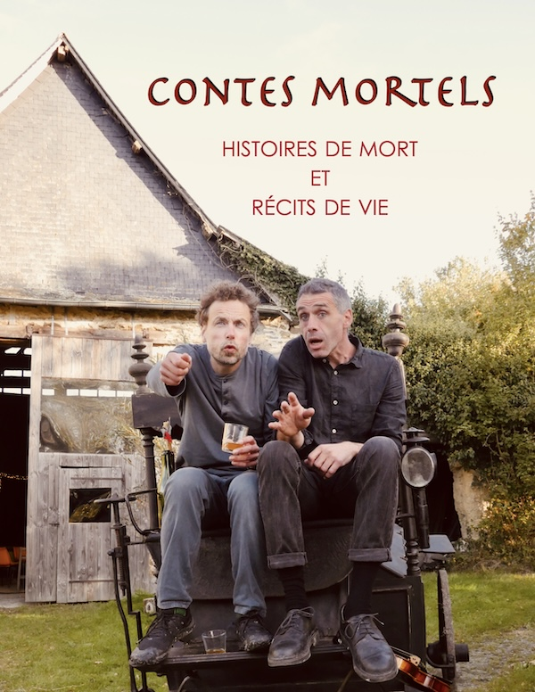

## Dernière actus

2 spectacles qui tournent en ce moment :
 - en solo : [par tous les chemins](spectacle/par-tous-les-chemins)
 

    <iframe width="100%" justify-content="flex-start" webkitallowfullscreen mozallowfullscreen allowfullscreen 
    src="https://player.vimeo.com/video/1018257490?badge=0&amp;autopause=0&amp;player_id=0&amp;app_id=58479&playsinline=false" type="video/mp4" frameborder="0" allow="autoplay;"  title="par tous les chemins"></iframe>

                
 - en duo (avec Adrien Choque) : [contes mortels](spectacle/contes-mortels)

 <a style="position:relative;" href="spectacle/contes-mortels">
 
    <!-- <iframe  width="100%"  webkitallowfullscreen mozallowfullscreen allowfullscreen    
    src="https://player.vimeo.com/video/1003556982?badge=0&amp;autopause=0&amp;player_id=0&amp;app_id=58479&playsinline=false" type="video/mp4" frameborder="0" allow="autoplay;"  title="contes mortels"></iframe> -->
</a>

 

Et bien sûr, toujours possibilité de faire des [histoires et chansons tirées du sac](spectacle/contes-et-chansons-tirees-sac)  

N'hésitez pas à [me contacter](contact) pour plus d'information

